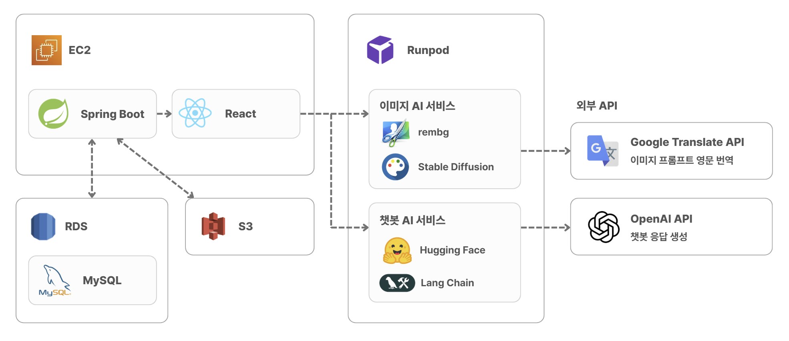
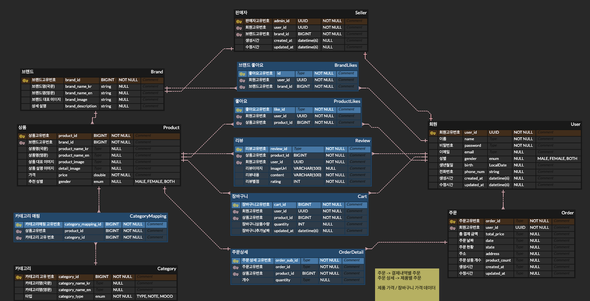
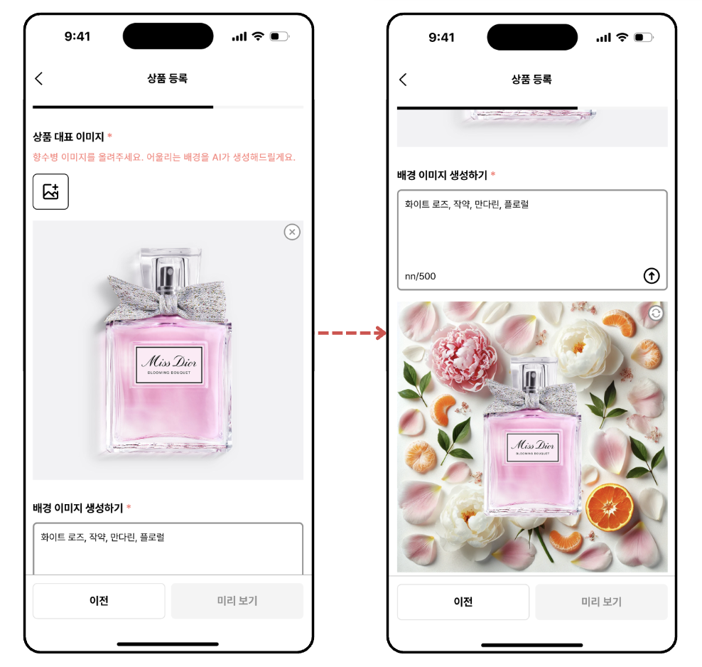
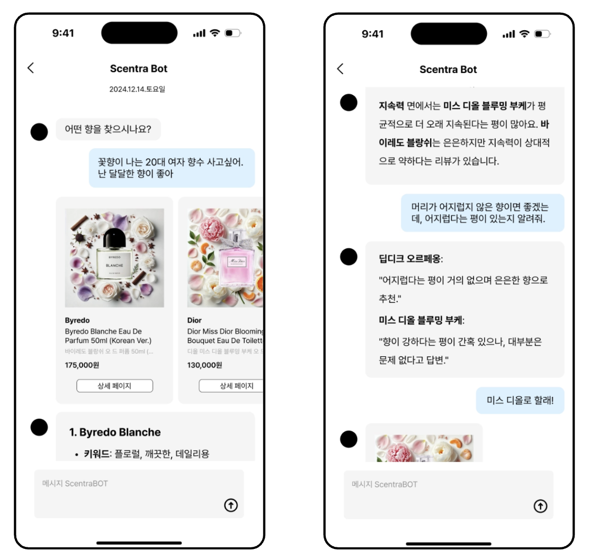

#  Scentra

### 생성형 AI 기반 향수 쇼핑 플랫폼

향수 재료를 바탕으로 AI가 배경 이미지를 자동 생성해주고, 대화형 챗봇이 원하는 향을 찾아주는 향수 이커머스 플랫폼입니다.

## 목차
1. [서비스 소개](#1-서비스-소개)
2. [기술 스택](#2-기술-스택)
3. [아키텍처](#3-아키텍처)
4. [핵심 기능](#4-핵심-기능)
5. [기능 상세](#5-기능-상세)

 

## 1. 서비스 소개
향수는 직접 시향하지 않고는 향을 가늠하기 어려운 상품 특성상, 온라인에서는 이미지와 텍스트 설명만으로 구매를 결정해야 하는 한계가 있습니다. 판매자 입장에서도 상품마다 어울리는 배경 이미지를 별도로 제작하는 데 비용과 시간이 들고, 구매자는 수많은 상품 중 원하는 향을 키워드 검색만으로 찾기 어렵습니다.

**Scentra**는 이 두 가지 문제를 생성형 AI로 풀어낸 향수 쇼핑 플랫폼입니다. 판매자가 향수 재료(노트)를 입력하면 AI가 어울리는 배경 이미지를 자동으로 생성해주고, 구매자는 대화형 챗봇에게 원하는 느낌을 설명하는 것만으로 향수와 리뷰를 추천받을 수 있습니다.

 

## 2. 기술 스택

| 구분 | 기술 |
|---|---|
| **Frontend** |    |
| **Backend** |        |
| **AI** |       |
| **Collaboration** |    |

 

## 3. 아키텍처

### 3.1 시스템 구성도

프론트엔드는 일반적인 비즈니스 로직(회원가입, 상품, 주문 등)은 백엔드를 통해 처리하고, AI 챗봇·AI 이미지 생성은 RunPod GPU Pod를 직접 호출합니다. OpenAI, Google Translate는 RunPod가 관리하는 서비스가 아닌 별도의 외부 API입니다.

### 3.2 ERD

<a href="#top">맨 위로 ↑</a>

 

## 4. 핵심 기능

| 구분 | 기능 | 설명 |
|---|---|---|
| **회원** | 역할별 UI 분리 | 판매자/구매자 회원가입 및 화면 분리, JWT 기반 인증 |
| **판매자** | AI 배경 이미지 자동 생성 | 향수 재료(노트)를 입력하면 AI가 어울리는 배경 이미지를 자동 생성 |
| | 상품/브랜드 관리 | 상품 등록/수정/삭제, 브랜드 정보 관리 |
| **구매자** | AI 챗봇 향수 검색 | 대화형으로 원하는 향이나 느낌을 입력하면 향수 추천 |
| | 상품 탐색 | 카테고리 및 키워드 검색, 좋아요(상품/브랜드), 장바구니, 주문 |
| | 리뷰 | 구매 상품에 대한 평점과 리뷰 작성 |

 

## 5. 기능 상세

### 5.1 AI 배경 이미지 생성 (판매자)

판매자가 상품을 등록할 때 향수의 노트(재료)를 입력하면, GPU 서버에서 이미지 생성 모델이 어울리는 배경 이미지를 만들어줍니다.

- 입력 프롬프트(한글)를 Google Translate API로 번역 후 Stable Diffusion 3.5로 배경 이미지 생성
- 별도의 배경 제거 엔드포인트에서 `rembg` 라이브러리로 원본 상품 이미지 배경을 제거해, 생성된 배경과 합성 가능
- 두 기능 모두 RunPod GPU Pod에서 FastAPI로 서빙되며, 프론트엔드가 백엔드를 거치지 않고 직접 호출

 

### 5.2 AI 챗봇 향수 검색 (구매자)

원하는 향의 느낌을 텍스트로 입력하면, RAG(Retrieval-Augmented Generation) 파이프라인을 통해 어울리는 향수와 실제 리뷰를 함께 추천합니다.

- 사용자 질문을 임베딩한 뒤 **FAISS**(로컬 벡터 인덱스)로 관련 향수 정보를 검색
- **LangChain**으로 검색된 컨텍스트와 질문을 프롬프트로 조합
- **OpenAI API**를 호출해 최종 추천 응답 생성
- AI 이미지 Pod와 마찬가지로 프론트엔드가 백엔드를 거치지 않고 직접 호출

 

### 5.3 상품 조회 성능 개선

상품의 리뷰 평균 평점과 개수를 매 조회마다 `AVG`/`COUNT`로 집계하는 대신, `Product`에 캐시 컬럼을 두는 반정규화로 조회 성능을 개선했습니다.

- 리뷰 1만 건 기준 API 응답속도 약 **28.6배**, 응답 페이로드 약 **5,723배** 개선
- N+1 문제를 join fetch로 해결해 쿼리 개수를 약 1,200건 → 1건으로 축소
- 자세한 실측 수치와 과정은 [backend README](./backend/README.md) 참고

<a href="#top">맨 위로 ↑</a>

